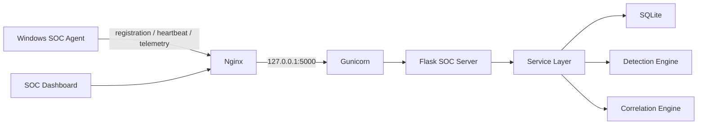

# SOC Sentinel

**A Lightweight Endpoint Detection, Response & Security Operations Platform**

SOC Sentinel is a Python-based cybersecurity platform for learning and prototyping SOC workflows. It provides endpoint registration, Windows agent heartbeats, telemetry collection, detection alerts, stateful correlation incidents, investigation workflows, endpoint response actions, and cloud-ready deployment configuration.

The project is intentionally modular: API routes stay thin, business logic lives in services, detection logic lives in independent rules, and the Windows agent remains separate from the Flask server.

> Status: Version 1.0 production validation build.

## Architecture



Core server modules:

- `soc_server/api`: JSON APIs for endpoints, telemetry, alerts, commands, dashboard, and health.
- `soc_server/routes`: Web dashboard routes.
- `soc_server/services`: Business logic and data access coordination.
- `soc_server/detection`: Modular telemetry-to-alert rule engine.
- `soc_server/correlation`: Stateful alert correlation engine.
- `soc_server/templates`: Bootstrap dashboard pages.

Agent modules:

- `agent/registration.py`: Automatic endpoint registration.
- `agent/heartbeat.py`: Online status updates.
- `agent/telemetry_queue.py`: Batched telemetry delivery with retry behavior.
- `agent/collectors`: Process, file, Windows Event Log, and network collector modules.
- `agent/command_client.py`: Endpoint response command polling.

## Features

- Endpoint registration with generated endpoint IDs such as `EP-000001`.
- Secure API key generation for registered agents.
- Device fingerprint support for endpoint identity validation.
- Windows agent with automatic registration and heartbeat.
- Process, file, and Windows Security Event Log telemetry collection.
- Telemetry API with filtering.
- Modular detection engine with independent rule classes.
- Alert dashboard and alert detail views.
- Stateful correlation rules that generate investigation incidents.
- Incident response workspace with notes, history, status, priority, assignment, and exports.
- Endpoint response command framework with safe operator actions.
- Live SOC Intelligence dashboard with operational statistics.
- Health API and Cloud Status panel for production validation.
- Environment-based configuration for local, LAN, and cloud deployments.
- SQLite by default with optional PostgreSQL support.
- Waitress and Gunicorn deployment guidance.

## Screenshots

Screenshots can be added under `screenshots/`.

Suggested captures:

- SOC Intelligence dashboard.
- Endpoint inventory.
- Telemetry view.
- Alert details.
- Incident investigation workspace.
- Endpoint response tab.

## Technology Stack

- Python 3.12+ for development, Python 3.14 validated for AWS deployment
- Flask
- SQLAlchemy
- SQLite
- Optional PostgreSQL
- Bootstrap 5
- Bootstrap Icons
- Chart.js
- JavaScript Fetch API
- Requests
- Watchdog
- PyInstaller
- Waitress for Windows production hosting
- Gunicorn for Linux production hosting

## Installation

Clone the repository and create a server virtual environment:

```powershell
cd SOC-Sentinel\soc_server
python -m venv .venv
.\.venv\Scripts\Activate.ps1
pip install -r requirements.txt
```

Create a local environment file from the example:

```powershell
cd ..
Copy-Item .env.example .env
```

Edit `.env` for your environment. For a public deployment, set a strong `SECRET_KEY`, a correct `PUBLIC_URL`, and a production database URL if PostgreSQL is used.

## Running Server

Development mode:

```powershell
cd SOC-Sentinel\soc_server
python app.py
```

Temporary Windows launcher:

```powershell
.\Start-SOC-Sentinel.ps1
```

The health API is available at:

```text
GET /health
GET /api/v1/health
```

## Agent Installation

Install agent dependencies:

```powershell
cd SOC-Sentinel\agent
pip install -r requirements.txt
```

Create an agent configuration from the example:

```powershell
Copy-Item config.example.json config.json
```

Set `server_url` to the SOC Sentinel server URL for your environment:

```json
{
  "server_url": "<soc-sentinel-server-url>",
  "endpoint_id": "",
  "api_key": "",
  "heartbeat_interval": 30,
  "run_at_startup": true,
  "show_tray_icon": true,
  "log_level": "INFO"
}
```

Run the agent:

```powershell
python main.py
```

On first run, the agent registers automatically and stores its generated endpoint credentials in `agent/config.json`. That runtime file is intentionally ignored by Git.

## Cloud Deployment

SOC Sentinel supports local, LAN, and cloud deployments through configuration only.

Production environment variables:

- `SECRET_KEY`
- `DATABASE_URL` or `DATABASE_PATH`
- `HOST`
- `PORT`
- `SERVER_URL`
- `LOG_LEVEL`
- `SESSION_TIMEOUT`

Recommended production options:

- Windows: Waitress behind a reverse proxy.
- Linux: Gunicorn behind Nginx with HTTPS.
- SQLite: acceptable for development and small demos.
- PostgreSQL: recommended for production or multi-user deployments.

See:

- `docs/DEPLOYMENT_AWS.md`
- `docs/DEPLOYMENT_CHECKLIST.md`
- `docs/ARCHITECTURE.md`
- `docs/DEPLOYMENT_GUIDE.md`
- `docs/DEVELOPMENT_GUIDE.md`
- `docs/ORACLE_CLOUD_DEPLOYMENT_GUIDE.md`
- `docs/CONFIGURATION_REFERENCE.md`

## Project Structure

```text
SOC-Sentinel/
|-- agent/
|   |-- collectors/
|   |-- commands/
|   |-- config.example.json
|   |-- main.py
|   `-- requirements.txt
|-- deploy/
|-- docs/
|-- screenshots/
|-- soc_server/
|   |-- api/
|   |-- correlation/
|   |-- database/
|   |-- detection/
|   |-- routes/
|   |-- services/
|   |-- static/
|   |-- templates/
|   |-- utils/
|   |-- app.py
|   |-- config.py
|   |-- models.py
|   |-- requirements.txt
|   `-- wsgi.py
|-- .env.example
|-- .gitignore
|-- CHANGELOG.md
|-- CONTRIBUTING.md
|-- LICENSE
|-- README.md
|-- Start-SOC-Sentinel.bat
|-- start.sh
|-- start.bat
|-- start.ps1
`-- Start-SOC-Sentinel.ps1
```

## Roadmap

- v0.1: Foundation, Flask application factory, SQLite, SQLAlchemy, dark dashboard.
- v0.2: Endpoint registration and management.
- v0.3: Windows agent registration and heartbeat.
- v0.4: Telemetry collection engine.
- v0.5: Detection engine and alerts.
- v0.6: Stateful alert correlation and SOC dashboard intelligence.
- v0.7: Incident response and investigation workflow.
- v0.8: Endpoint response command framework.
- v0.9: Cloud-ready configuration, health checks, logging, backup, deployment docs.
- v1.0: Production validation, EC2 deployment accuracy, health checks, and release documentation.

## Version History

See `CHANGELOG.md` for release details.

## Security Notes

Do not commit runtime configuration, generated API keys, databases, logs, packaged executables, or cloud credentials. Use `.env.example` and `agent/config.example.json` as templates.

This project is not a replacement for a production EDR or SIEM. Authentication, RBAC, tenant isolation, advanced hardening, and production-grade secrets management must be added before use in a real environment.

## License

MIT License. See `LICENSE`.

## Developer

Anuj Prajapati

- Portfolio: [anuj.unaux.com](https://anuj.unaux.com)
- LinkedIn: [anuj-prajapati-work](https://www.linkedin.com/in/anuj-prajapati-work/)
- GitHub: [anujprajapati2109](https://github.com/anujprajapati2109)
