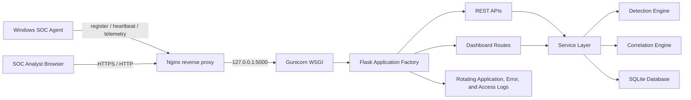

# SOC Sentinel Architecture



Production process flow:

```text
EC2 boot
  -> systemd starts nginx
  -> systemd starts soc-sentinel.service
  -> Gunicorn loads soc_server/wsgi.py
  -> Flask creates the SOC Sentinel app
  -> Nginx proxies public traffic to 127.0.0.1:5000
```
